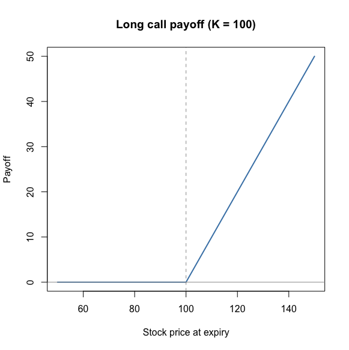
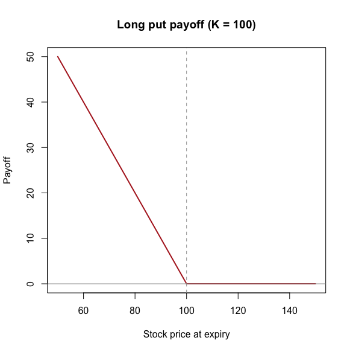
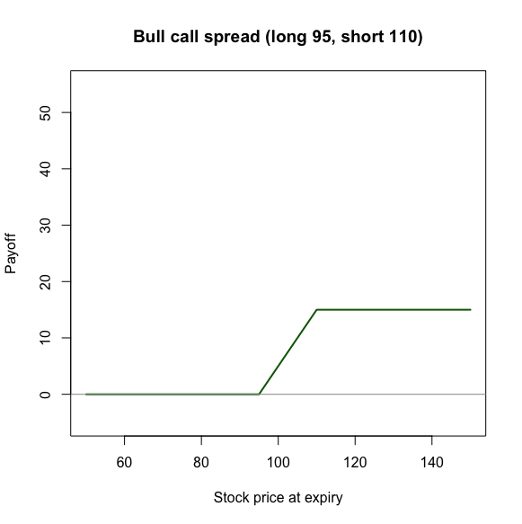
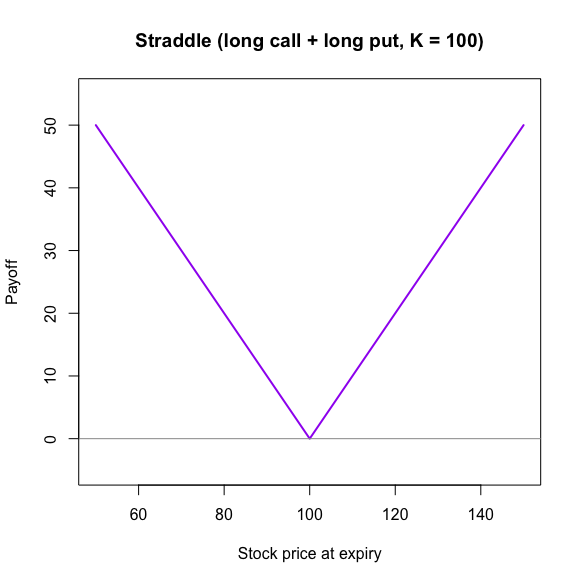

# Phase 1: Foundations

Establishes the rules any option price must obey, before any pricing
model is built. Everything in later phases is checked against these
rules.

## Payoff function

An option gives the right, not the obligation, to buy (call) or sell
(put) a stock at a fixed strike price. Payoffs always take a
"whichever is bigger, or zero" form, since the holder only exercises
when it helps them:

- Call: `max(S_T - K, 0)`
- Put:  `max(K - S_T, 0)`

Implemented with `pmax()` rather than `max()` so the function works
element-wise on a whole vector of stock prices at once — needed later
for the binomial tree's terminal nodes and Monte Carlo's simulated
paths.

The capped-downside, uncapped-upside shape (for the call) is the
source of option value: more uncertainty in the stock can only help
the holder, since losses are floored at zero. This is why volatility
increases price for both calls and puts.

## Combination strategies (illustrative, not load-bearing)

Any position is a sum of basic payoffs, with a minus sign for
anything sold.

**Bull call spread** (long 95 call, short 110 call): the short leg is
subtracted, since it's a liability. Payoff is capped at 15, the gap
between strikes — upside is traded for premium collected upfront.

**Straddle** (long call + long put, both K=100): pays on a large move
in either direction, nothing if the stock is flat. A pure bet on
volatility with no view on direction — the clearest illustration of
why a pricing model can quote a price without any opinion on where a
stock is headed.

## Put-call parity

    C - P = S*exp(-qT) - K*exp(-rT)

For European options, same strike and expiry. Not a claim that C = P
— the two differ by an amount fixed entirely by S, K, r, q, T, with no
role for volatility or a view on direction.

**Derivation (replication):** two ways to end up owning one share a
year from now, having effectively paid K for it.

1. Long call + short put, both at K. Whichever is in the money forces
   the same outcome: the holder ends up buying the stock for K.
2. Borrow `K*exp(-rT)` today (grows to K by expiry), buy `exp(-qT)`
   shares, reinvest dividends so the share count grows to exactly 1
   by expiry.

Both strategies have identical payoffs in every outcome, so they must
cost the same today, or a riskless arbitrage exists (buy the cheap
side, sell the expensive side, pocket the difference regardless of
what the stock does).

**Why it matters:** holds regardless of pricing model (tree,
Black-Scholes, Monte Carlo), making it an independent cross-check used
in Phases 2-4. `check_parity()` returns the difference and a tolerance
flag rather than a bare TRUE/FALSE, so a real bug (large diff) is
distinguishable from floating-point noise (~1e-15).

Verified: constructed C=10, S=K=100, r=5%, q=2%, T=1 → P=7.103075,
diff ≈ 1e-15, holds. Deliberately offsetting P by +2 → diff ≈ -2,
holds = FALSE, confirming the check catches real errors.

## No-arbitrage bounds

- Call: `max(S*exp(-qT) - K*exp(-rT), 0) <= C <= S*exp(-qT)`
- Put:  `max(K*exp(-rT) - S*exp(-qT), 0) <= P <= K*exp(-rT)`
- American put upper bound: `K` (immediate exercise), not discounted.

Upper bound: a call can't be worth more than the stock itself, since
the call is a strictly weaker claim (pay K to get it) than owning the
stock outright. Lower bound: same replication logic as parity, with
the offsetting option assumed worthless.

**Why it matters:** used in Phase 5 to filter real market quotes
before solving for implied volatility. A quote outside these bounds
isn't real arbitrage — it signals bad or stale data that should be
discarded.

Verified against the constructed C, P above: both within bounds; a
deliberately absurd call price (150 on a 100 stock) correctly flagged
out of bounds; American put upper bound correctly jumps from
`K*exp(-rT)`=95.12 to K=100.